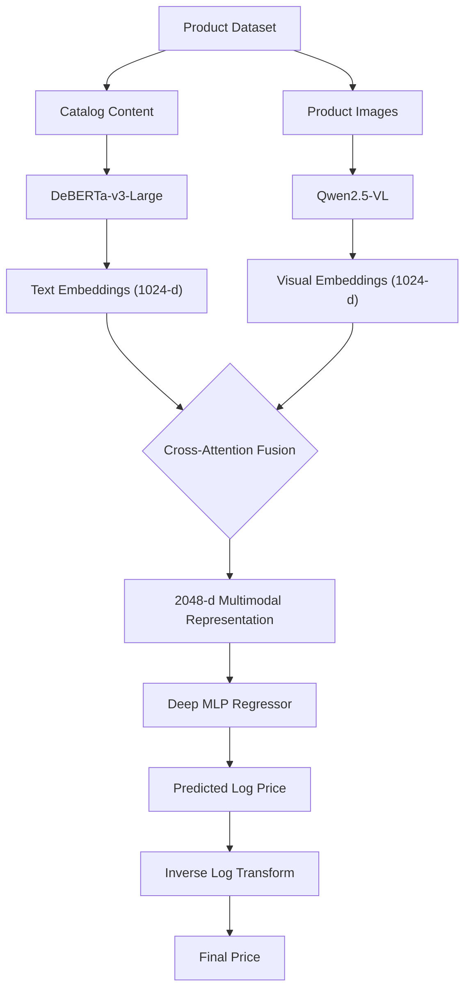

# Amazon ML Challenge 2025 – Multimodal Product Price Prediction

Predicting product prices from catalog descriptions and product images using transformer-based multimodal learning.

---

## Results

| Metric                  | Value                |
| ----------------------- | -------------------- |
| Public Leaderboard Rank | **91**               |
| Validation SMAPE        | **42.20%**           |
| Training Samples        | **67,499**           |
| Text Encoder            | **DeBERTa-v3-Large** |
| Vision Encoder          | **Qwen2.5-VL**       |
| Fusion Strategy         | **Cross-Attention**  |

---

## Project Overview

This project was developed for the Amazon ML Challenge 2025.

The objective was to predict product prices from:

* Product catalog content
* Product images

The problem is formulated as a supervised multimodal regression task where textual and visual information are jointly processed to estimate product price.

---

## Dataset

Dataset: https://www.kaggle.com/datasets/suvroo/amazon-ml

### Features

| Feature         | Description                                                      |
| --------------- | ---------------------------------------------------------------- |
| sample_id       | Unique product identifier                                        |
| catalog_content | Product title, description, specifications, quantity information |
| image_link      | Product image URL                                                |
| price           | Target variable                                                  |

### Dataset Characteristics

* 67K+ products
* Multiple product categories
* Semi-structured catalog descriptions
* Right-skewed price distribution
* Multimodal inputs (text + image)

---

## Model Architecture

### Architecture Diagram

### Pipeline




---

## Data Preprocessing

### Catalog Processing

The catalog content contains:

* Product title
* Product description
* Product specifications
* Quantity information

### Cleaning Pipeline

* Text normalization
* Unit standardization
* Quantity extraction
* Missing value handling
* Noise removal
* Sequence truncation

---

## Target Transformation

Product prices exhibited a heavily right-skewed distribution.

To improve optimization stability, the target variable was transformed using:

```text
y_log = log(1 + y)
```

During inference:

```text
y = exp(y_log) - 1
```

This reduced the influence of extreme outliers and improved convergence.

---

## Text Encoder

### Final Choice: DeBERTa-v3-Large

Reasons:

* Strong contextual understanding
* Better semantic representations
* Handles long product descriptions effectively
* Superior regression performance

The CLS representation is extracted and projected into a shared latent space.

---

## Vision Encoder

### Final Choice: Qwen2.5-VL

Product images provide important pricing signals:

* Packaging quality
* Product appearance
* Brand indicators
* Category information

Qwen2.5-VL generates high-level semantic visual embeddings that complement textual features.

---

## Multimodal Fusion

Simple feature concatenation produced limited gains.

A Cross-Attention Fusion layer was introduced to enable interactions between text and image representations.

### Text-to-Image Attention

```text
Attention(Q_t, K_v, V_v)
```

### Image-to-Text Attention

```text
Attention(Q_v, K_t, V_t)
```

This helps learn relationships such as:

* Product descriptions ↔ packaging appearance
* Quantity information ↔ visual quantity cues
* Brand names ↔ visual branding signals

---

## Regression Head

The fused representation is passed to a Deep MLP Regressor.

Architecture:

```text
2048
 ↓
1024
 ↓
512
 ↓
256
 ↓
1
```

Components:

* GELU Activation
* Batch Normalization
* Dropout
* Residual Connections

Output:

```text
Predicted Log Price
```

---

## Training Configuration

| Parameter             | Value            |
| --------------------- | ---------------- |
| Text Encoder          | DeBERTa-v3-Large |
| Vision Encoder        | Qwen2.5-VL       |
| Batch Size            | 16               |
| Max Sequence Length   | 160              |
| Encoder Learning Rate | 2e-5             |
| Head Learning Rate    | 1e-3             |
| Dropout               | 0.2              |
| Epochs                | 20               |
| Optimizer             | AdamW            |
| Mixed Precision       | FP16             |

---

## Loss Function

Several objectives were evaluated:

* MSE Loss
* MAE Loss
* Log-MSE Loss
* Huber Loss

### Final Choice: Huber Loss

Benefits:

* Robust to outliers
* Stable gradients
* Improved convergence on skewed targets

---

## Evaluation Metric

### SMAPE

```text
SMAPE = (100/N) × Σ |y - ŷ| / ((|y| + |ŷ|)/2)
```

Lower values indicate better performance.

---

## Final Performance

| Metric                  | Value            |
| ----------------------- | ---------------- |
| Validation SMAPE        | 42.50%           |
| Public Leaderboard Rank | 91               |
| Training Samples        | 67,499           |
| Epochs                  | 20               |
| Text Encoder            | DeBERTa-v3-Large |
| Vision Encoder          | Qwen2.5-VL       |
| Fusion Strategy         | Cross-Attention  |
| Target Transformation   | log1p            |

---

## Key Learnings

* Textual information was the strongest pricing signal.
* DeBERTa-v3-Large consistently outperformed smaller transformer models.
* Qwen2.5-VL improved performance on visually distinctive products.
* Cross-attention outperformed simple feature concatenation.
* Log-price transformation improved optimization stability.
* Dedicated regression heads performed better than instruction-tuned LLM approaches for price prediction.

---

##
