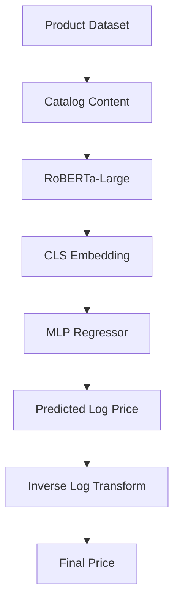
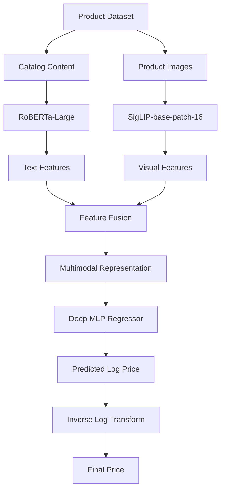

# Amazon ML Challenge 2025 – Multimodal Product Price Prediction

---

## Approach 1: Text-Only Transformer

The first submission used only product catalog information.

### Architecture



### Configuration

| Component               | Value           |
| ----------------------- | --------------- |
| Text Encoder            | RoBERTa-Large   |
| Input Modality          | Catalog Content |
| Maximum Sequence Length | 512             |
| Loss Function           | MSE Loss        |
| Optimizer               | AdamW           |
| Mixed Precision         | FP16            |
| Target Transformation   | log1p(price)    |

### Regression Head

```text
1792 (1024+768)
 ↓
512
 ↓
256
 ↓
128
 ↓
1
```

### Training Objective

```text
Loss = MSE(predicted_log_price, target_log_price)
```

The model uses the CLS embedding from RoBERTa-Large and predicts the logarithm of product price through a deep regression head.

---

## Approach 2: Text + Vision Multimodal Model

The second submission incorporated visual information from product images alongside catalog text.

### Architecture



### Components

| Component             | Model                |
| --------------------- | --------------       |
| Text Encoder          | RoBERTa-Large        |
| Vision Encoder        | SigLIP-base-patch 16 |
| Fusion Strategy       | Feature Fusion       |
| Regression Head       | Deep MLP             |
| Target Transformation | log1p(price)         |

### Motivation

The multimodal model was designed to capture:

* Product appearance
* Packaging quality
* Brand-specific visual cues
* Quantity and packaging information
* Category-specific pricing signals

---

## Final Results

| Metric                  | Value  |
| ----------------------- | ------ |
| Public Leaderboard Rank | 91     |
| Validation SMAPE        | 42.50% |
| Training Samples        | 67,499 |

---

## Learnings

* Product descriptions contained the strongest pricing signal.
* RoBERTa-Large provided strong semantic understanding of catalog content.
* Visual information improved prediction quality for visually distinctive categories.
* Log-price prediction stabilized optimization.
* Transformer-based encoders significantly outperformed traditional feature engineering approaches.

